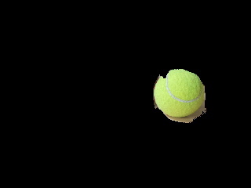
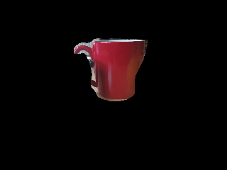
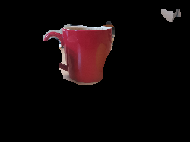
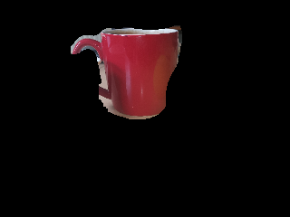

## TP 1: Color Spaces and Segmentation
#### Author: Bruno Castro (GitHub: bdCastro)

## Introduction

In this lab, we will explore the HSV and LAB color spaces, and use them to segment objects in images.

## 1. Color Spaces

### 1.1. RGB

RGB is an additive color model in which red, green and blue lights are added together in various ways to reproduce a broad array of colors. The name of the model comes from the initials of the three additive primary colors, red, green, and blue.

### 1.2. HSV

HSV is a color space that models the way humans perceive color. It is a nonlinear transformation of the RGB color space. The HSV representation models how colors appear under light, and is a better representation for segmenting objects based on their color.

### 1.3. LAB

The Lab color space describes mathematically all perceivable colors in the three dimensions L for lightness and a and b for the color opponents green–red and blue–yellow. Other color spaces, such as RGB or CMYK store colors as a mixture of primary colors. Lab is a device-independent color space, which means that the same color values will be interpreted to the same color, regardless of the device used to display them.

## 2. Segmentation

### Original Image

<p float="left">
  
</p>

### Segmenting the Tennis Ball

This part od the TP was already given to us. This segmentation was done using the HSV color space, and its straight foward. We just need to find the right values for the lower and upper bounds of the color range we want to segment.

```python
# define color segmentation intervals
lower = np.array([20,80,80])
upper = np.array([55,255,255])
```
### Result



### Segmenting the Mug

In order to segment the mug, I used a similar approach to the one used to segment the tennis ball. The main problem with it is: the range the HUEs of the mug wrap around the HSV color space. In order to go around this problem, I decided to segment it out of the image. That is, segment everything that is not the mug. Then, I inverted the mask and applied it to the original image.

```python
# define color segmentation intervals
lower = np.array([8,0,0])
upper = np.array([160,200,240])

# invert the mask
mask = cv.bitwise_not(mask)
```

### Result



The segmentation is not perfect by any means. A good chunk of the background is missing, and the mug is not completely segmented.

### Segmenting the Coffee Cup

As a final segmentation, I tried to segment the coffee cup in the image. I used a very similar approach, with a main difference: Instead of using the HSV color space, I used the LAB color space, because the coffee cup had a better contrast in this color space.

The range chosen for the segmentation is as follows:

```python
# define color segmentation intervals
lower = np.array([110,0,0])
upper = np.array([255,122,135])

# threshold the image
mask = cv.inRange(lab, lower, upper)
```

### Result


Similar to the mug, the segmentation here also has its flaws. The coffee cup in this image is likeley the hardest one to be segmented. It has more than one color, and has a lower contrast with the background.

## 3. Trying these parameters in similar images

Along with the image used to the segmentation, two exatra images were provided. I tried to use the same parameters used in the previous segmentations to segment the tennis ball, the mug and the coffee cup in these images.

### Mug

<p float="left">
  
   
</p>

### Coffee Cup

<p float="left">
  
   
</p>

In both cases, the results were not good. For the mug, the first segmentation got a good chunk of the background, but the second did relatively well.

For the coffee cup, the first segmentation missed most of the cup, and the second one, though not perfect, somehow performed better than the original (the one I did the tunning for).

## 4. Conclusion

Image segentation is a hard task. Requires a lot of fine tuning and a lot of trial and error. The results are not always good, and sometimes, even with a lot of effort, not even satisfactory.

Specialy when dealing with images, choices as choosing the color space, the color range, the thresholding method, etc, are very important. They can make or break the segmentation. And even then , the contditions of the eviroment where the image was taken, and the hardware used to take the image, can also affect the quality of the segmentation.